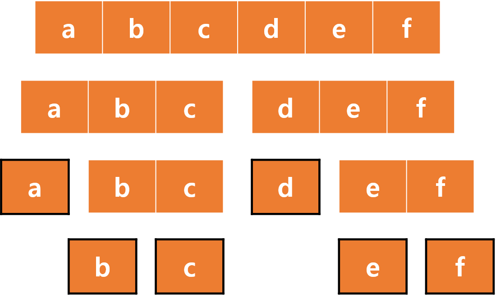

# 분할 정복(Divide & Conquer)
분할 정복 알고리즘은 주어진 문제를 둘 이상의 부분 문제로 나눈 뒤 각 문제에 대한 답을 재귀 호출을 이용해 계산하고, 각 부분 문제의 답으로부터 전체 문제의 답을 계산해 낸다.  
분할 정복이 일단적인 재귀 호출과 다른 점은 문제를 한 조각과 나머지 전체로 나누는 대신 거의 같은 크기의 부분 문제로 나누는 것이다.

</img>

## 분할 정복을 활용한 예
### 거듭제곱 구하기 (power() 함수)
power(x, y) = x ^ y (x에 y제곱) 이라고 할때  
power(x, y) = power(x, y / 2) * power(x, y / 2) 이다.  
power(x, y)를 구하는 문제를 power(x, y / 2) 부분 문제로 나눌 수 있다.

<pre>
<code>
int pow(int x, int y) // x : 밑수, y : 지수
{
	if(y == 0)
		return 1;
	if(y % 2 > 0)
		return x * pow(x, y - 1);
	int half = pow(x, y / 2);
	return half * half;
}
</code>
</pre>

y가 홀수 인 경우는 반으로 딱 안 나눠지므로 그냥 x * pow(x, y - 1)로 구하고 있다.
### 시간 복잡도
